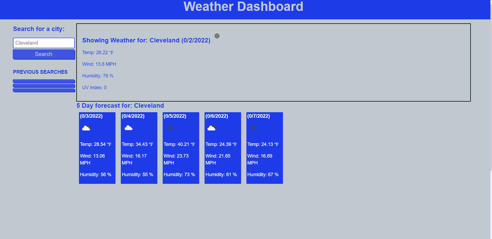

# Weather Dashboard

In this website I have created a dashboard where a user can find weather information for a specified place. The website works using OpenWeather API that allows the user to find out the temperature, wind speed, humidity, UV index, as well as a corresponding icon. The users are also able to see weather data for up to five days in advance. 

# Website features 

[Live website link](https://mikemonihan.github.io/Weather_Dashboard/)

[Live github repo link](https://github.com/MikeMonihan/Weather_Dashboard)